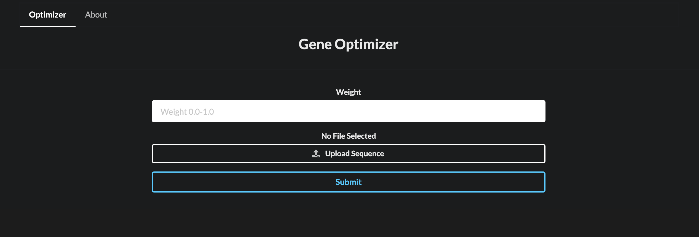

# Gene Converter (Reduce G/C nucleotides in sequence)

This is a simple Python CLI tool to reduce the G/C count in a sequence of RNA while still retaining the same amino acids.

## Requirements
1. Python 3 with the packages `pandas` and `biopython` installed. Execute `pip install pandas biopython` to satisfy the requirements in terminal.
2. Distribution of codons in the human genome and also a mapping file between codons and amino acids. By default, they are searched for in the working directory underneath a folder called `data`.
3. A sequence in the fasta format that you want to convert.

## Usage
Place the python file where you want. Add a directory called `data` there with files named `codons.txt`, `humanCodon_freqPerThousand.csv`, and whatever your sequence is in fasta format. Note, that these can be change but these are the defaults.

Run the command
```python gene_converter.py --seq data/<my sequence>.fasta```

By default, the output will be in the same folder but appended with `optimzed` in the file name.

Run the command
```python gene_converter.py -h``` to see all options

### Optimization Aggression

By default, the optimizer will look to 80% reduce G/C and 20% to use common human codons. You can change this by adding the `--weight` argument and specify a value between 0-1.

For example,
```python gene_converter.py --weight 1.0``` will try to only use A/T nucleotides when it can, irregardless of commonness of codons.

### Example Output

Command: `python gene_converter.py --seq data/hngly1-mrna.fasta --weight 0.1`

```
=========================================================================================================================================================================================================================================================================
Optimizing for 10.00% A/T count (decrease G/C) and 90.00% frequency in human genome
=========================================================================================================================================================================================================================================================================
ATGGCCGCCGCCGCCCTGGGCAGCAGCAGCGGCAGCGCCAGCCCTGCCGTGGCCGAGCTGTGCCAGAATACACCTGAGACATTCCTGGAGGCCAGCAAGCTGCTGCTGACATACGCCGACAATATCCTGAGAAATCCTAATGACGAGAAGTACAGAAGCATCAGAATCGGCAATACAGCCTTCAGCACAAGACTGCTGCCTGTGAGAGGCGCCGTGGAGTGCCTGTTCGAGATGGGCTTCGAGGAGGGCGAGACACACCTGATCT
TCCCTAAGAAGGCCAGCGTGGAGCAGCTGCAGAAGATCAGAGACCTGATCGCCATCGAGAGAAGCAGCAGACTGGACGGCAGCAATAAGAGCCACAAGGTGAAGAGCAGCCAGCAGCCTGCCGCCAGCACACAGCTGCCTACAACACCTAGCAGCAATCCTAGCGGCCTGAATCAGCACACAAGAAATAGACAGGGCCAGAGCAGCGACCCTCCTAGCGCCAGCACAGTGGCCGCCGACAGCGCCATCCTGGAGGTGCTGCAGAG
CAATATCCAGCACGTGCTGGTGTACGAGAATCCTGCCCTGCAGGAGAAGGCCCTGGCCTGCATCCCTGTGCAGGAGCTGAAGAGAAAGAGCCAGGAGAAGCTGAGCAGAGCCAGAAAGCTGGACAAGGGCATCAATATCAGCGACGAGGACTTCCTGCTGCTGGAGCTGCTGCACTGGTTCAAGGAGGAGTTCTTCCACTGGGTGAATAATGTGCTGTGCAGCAAGTGCGGCGGCCAGACAAGAAGCAGAGACAGAAGCCTGCTG
CCTAGCGACGACGAGCTGAAGTGGGGCGCCAAGGAGGTGGAGGACCACTACTGCGACGCCTGCCAGTTCAGCAATAGATTCCCTAGATACAATAATCCTGAGAAGCTGCTGGAGACAAGATGCGGCAGATGCGGCGAGTGGGCCAATTGCTTCACACTGTGCTGCAGAGCCGTGGGCTTCGAGGCCAGATACGTGTGGGACTACACAGACCACGTGTGGACAGAGGTGTACAGCCCTAGCCAGCAGAGATGGCTGCACTGCGACG
CCTGCGAGGACGTGTGCGACAAGCCTCTGCTGTACGAGATCGGCTGGGGCAAGAAGCTGAGCTACGTGATCGCCTTCAGCAAGGACGAGGTGGTGGACGTGACATGGAGATACAGCTGCAAGCACGAGGAGGTGATCGCCAGAAGAACAAAGGTGAAGGAGGCCCTGCTGAGAGACACAATCAATGGCCTGAATAAGCAGAGACAGCTGTTCCTGAGCGAGAATAGAAGAAAGGAGCTGCTGCAGAGAATCATCGTGGAGCTGGT
GGAGTTCATCAGCCCTAAGACACCTAAGCCTGGCGAGCTGGGCGGCAGAATCAGCGGCAGCGTGGCCTGGAGAGTGGCCAGAGGCGAGATGGGCCTGCAGAGAAAGGAGACACTGTTCATCCCTTGCGAGAATGAGAAGATCAGCAAGCAGCTGCACCTGTGCTACAATATCGTGAAGGACAGATACGTGAGAGTGAGCAATAATAATCAGACAATCAGCGGCTGGGAGAATGGCGTGTGGAAGATGGAGAGCATCTTCAGAAAG
GTGGAGACAGACTGGCACATGGTGTACCTGGCCAGAAAGGAGGGCAGCAGCTTCGCCTACATCAGCTGGAAGTTCGAGTGCGGCAGCGTGGGCCTGAAGGTGGACAGCATCAGCATCAGAACAAGCAGCCAGACATTCCAGACAGGCACAGTGGAGTGGAAGCTGAGAAGCGACACAGCCCAGGTGGAGCTGACAGGCGACAATAGCCTGCACAGCTACGCCGACTTCAGCGGCGCCACAGAGGTGATCCTGGAGGCCGAGCTGA
GCAGAGGCGACGGCGACGTGGCCTGGCAGCACACACAGCTGTTCAGACAGAGCCTGAATGACCACGAGGAGAATTGCCTGGAGATCATCATCAAGTTCAGCGACCTGTGA
=========================================================================================================================================================================================================================================================================
Total Nucleotides: 1965. G Count: 632, C Count: 501, A Count: 538, T Count: 294
=========================================================================================================================================================================================================================================================================
G/C Count: 1133
G/C Percentage: 57.66%
=========================================================================================================================================================================================================================================================================
Wrote output file to data/hngly1-mrna_optimized.fasta
=========================================================================================================================================================================================================================================================================
```

The website version can be seen on the branch `website`. Here is what it looks like:



